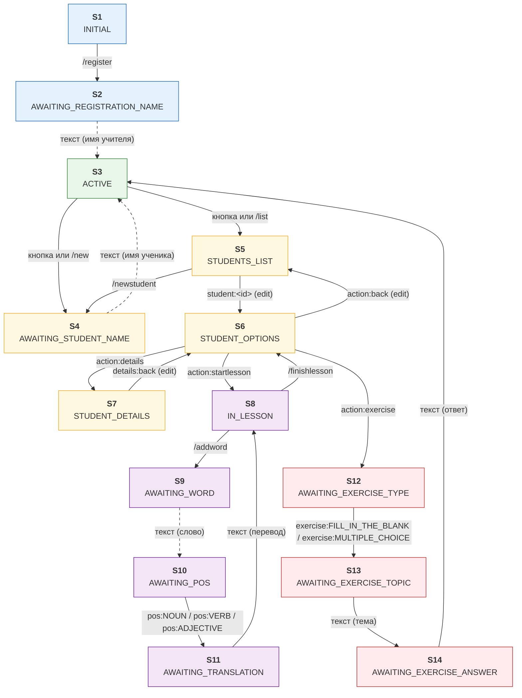

# Chatbot State Machine

## Описание состояний

| # | Состояние | Назначение | Как попадаем | Как выходим |
|---|-----------|------------|--------------|-------------|
| S1 | `INITIAL` | Пользователь открыл бота, но не зарегистрирован | Автоматически при первом входе | `/register` → S2 |
| S2 | `AWAITING_REGISTRATION_NAME` | Ожидание имени учителя | Из S1 по `/register` | Ввод имени → S3 |
| S3 | `ACTIVE` | Зарегистрирован, без активного урока. Idle-состояние | Из S2, S4, S5 | Кнопки/команды → S4, S5 |
| S4 | `AWAITING_STUDENT_NAME` | Ожидание имени нового ученика | Из S3 или S5 по `/new` | Ввод имени → S3 |
| S5 | `STUDENTS_LIST` | Inline-кнопки со списком учеников | Из S3 по `/list`, из S6 по `action:back` | `student:<id>` → S6, `/new` → S4 |
| S6 | `STUDENT_OPTIONS` | Меню действий для выбранного ученика | Из S5 по `student:<id>`, из S7 по `details:back`, из S8/S14 | `action:*` → S7/S8/S12/S5 |
| S7 | `STUDENT_DETAILS` | Карточка ученика (TODO) | Из S6 по `action:details` | `details:back` → S6 |
| S8 | `IN_LESSON` | Активный урок для выбранного ученика | Из S6 по `action:startlesson` | Кнопка/`/addword` → S9, кнопка/`/finishlesson` → S6 |
| S9 | `AWAITING_WORD` | Шаг 1: ожидание английского слова | Из S8 по кнопке `/addword` | Ввод слова → S10 |
| S10 | `AWAITING_POS` | Шаг 2: выбор части речи (inline-кнопки) | Из S9 | `pos:noun`/`pos:verb`/`pos:adjective` → S11 |
| S11 | `AWAITING_TRANSLATION` | Шаг 3: ввод перевода | Из S10 | Ввод перевода → S8 |
| S12 | `AWAITING_EXERCISE_TYPE` | Выбор типа упражнения (inline-кнопки) | Из S6 по `action:exercise` | `exercise:*` → S13 |
| S13 | `AWAITING_EXERCISE_TOPIC` | Ввод темы упражнения | Из S12 | Ввод темы → S14 |
| S14 | `AWAITING_EXERCISE_ANSWER` | Ожидание ответа на упражнение | Из S13 | Ввод ответа → S6 |

## Конфиг состояний

Каждое состояние определяет, какие триггеры обработаны переходами; всё остальное уходит
в дефолтный `Handler` состояния.
**Типы триггеров** (`Action`): команда (`BOT_COMMAND`), reply-кнопка (текст из `Buttons.REPLY_BUTTONS`),
ввод (свободный текст), callback (inline-кнопка, префикс `prefix:payload`).

| # | Состояние | Команды | Кнопки (reply) | Ввод | Callback |
|---|-----------|---------|----------------|------|----------|
| S1 | `INITIAL` | `/register` → S2, `/start`,`/help` → приветствие | — | дефолт | — |
| S2 | `AWAITING_REGISTRATION_NAME` | дефолт | — | ✅ `RegisterTeacher` → S3 | — |
| S3 | `ACTIVE` | `/new` → S4, `/list` → S5, `/help`,`/start` → меню | «➕ Новый студент» → S4, «👥 Мои студенты» → S5 | дефолт | — |
| S4 | `AWAITING_STUDENT_NAME` | дефолт | — | ✅ `CreateStudentWithDictionary` → S3 | — |
| S5 | `STUDENTS_LIST` | `/new` → S4, `/list`,`/help` → обновить список | — | дефолт | `student:<id>` → S6, `back:main` → S3 |
| S6 | `STUDENT_OPTIONS` | дефолт | — | дефолт | `action:startlesson` → S8, `action:details` → S7, `action:exercise` → S12, `action:back` → S5 |
| S7 | `STUDENT_DETAILS` | дефолт | — | дефолт | `details:back` → S6 |
| S8 | `IN_LESSON` | `/addword` → S9, `/finishlesson` → S6, `/help` → подсказка | «➕ Добавить слово» → S9, «🏁 Завершить урок» → S6 | дефолт | — |
| S9 | `AWAITING_WORD` | дефолт | — | ✅ сохранить `wordValue` → S10 | — |
| S10 | `AWAITING_POS` | дефолт | — | дефолт | `pos:noun`/`pos:verb`/`pos:adjective` → S11 |
| S11 | `AWAITING_TRANSLATION` | дефолт | — | ✅ `AddWordToDictionary` + `AddWordToLesson` → S8 | — |
| S12 | `AWAITING_EXERCISE_TYPE` | дефолт | — | дефолт | `exercise:fillintheblank`, `exercise:multiplechoice` → S13 |
| S13 | `AWAITING_EXERCISE_TOPIC` | дефолт | — | ✅ `GenerateExercise` → S14 | — |
| S14 | `AWAITING_EXERCISE_ANSWER` | дефолт | — | ✅ `CheckExercise` → S6 | — |

### Дефолтные Handler'ы

Любой триггер, для которого в состоянии нет перехода, обрабатывается дефолтным `Handler`:

| Состояние | Ответ |
|-----------|-------|
| S1 `INITIAL` | «Добро пожаловать! Для начала зарегистрируйтесь: /register» |
| S2 `AWAITING_REGISTRATION_NAME` | «Введите ваше имя» |
| S3 `ACTIVE` | «Неизвестная команда. /help — список команд» |
| S4 `AWAITING_STUDENT_NAME` | «Введите имя ученика» |
| S5 `STUDENTS_LIST` | «Выберите ученика кнопками ниже» |
| S6 `STUDENT_OPTIONS` | «Используйте кнопки ниже» |
| S7 `STUDENT_DETAILS` | «Используйте кнопки ниже» |
| S8 `IN_LESSON` | «Используйте кнопки ниже» + клавиатура урока |
| S9 `AWAITING_WORD` | «Введите слово на английском» |
| S10 `AWAITING_POS` | «Выберите часть речи кнопками ниже» |
| S11 `AWAITING_TRANSLATION` | «Введите переводы через запятую» |
| S12 `AWAITING_EXERCISE_TYPE` | «Выберите тип упражнения кнопками ниже» |
| S13 `AWAITING_EXERCISE_TOPIC` | «Введите тему упражнения» |
| S14 `AWAITING_EXERCISE_ANSWER` | «Введите ваш ответ на упражнение» |

## Принцип работы

### Обработка Update (`EnglishTutorBot.onUpdateReceived`)

```
chatId  = extractChatId(update)
chat    = chatService.getOrCreate(chatId)        // load
action  = updateParser.parseUpdate(update)       // Update -> Action
result  = stateMachine.applyAction(chat, action) // переход или дефолтный Handler
chatService.save(chat)                           // save — в вызывающем коде, не в машине
response = converter.convert(result, chatId)     // ActionResult -> Telegram API
send / edit / delete
```

`StateMachine.applyAction` — чистая маршрутизация: по типу действия выбирается таблица
переходов (`commandTransitions` / `buttonTransitions` / `callbackTransitions` по ключу
`(state, триггер)`, `inputTransitions` по `state`). Переход не найден → дефолтный `Handler`
состояния, чат не меняется.

### Формирование ответа

Ответ возвращает сам переход (`ActionResult`): текст, inline- или reply-клавиатура, редактирование
сообщения (`EditMessageText` c `messageId` из callback) или удаление. Билдеры ответов —
статические классы `view/*View`, тексты — `view/Messages`.

| Состояние | Экран |
|-----------|-------|
| S1 `INITIAL` | «Добро пожаловать! Для начала зарегистрируйтесь: /register» |
| S2 `AWAITING_REGISTRATION_NAME` | «Введите ваше имя» |
| S3 `ACTIVE` | «Главное меню» + Reply-кнопки: [➕ Новый студент] [👥 Мои студенты]. При переходе в S3 из inline-экранов reply-клавиатура возвращается |
| S4 `AWAITING_STUDENT_NAME` | «Введите имя нового ученика» |
| S5 `STUDENTS_LIST` | «Ваши ученики:» + inline-кнопки с именами |
| S6 `STUDENT_OPTIONS` | «Ученик: {name}» + inline-кнопки: [▶ Start Lesson] [📋 Details] [🎯 Exercise] [◀ Back]. Редактируется (EditMessageText) при переходе из S5/S7/S8/S14 |
| S7 `STUDENT_DETAILS` | «Детали ученика (TODO)» + кнопка [◀ Back] |
| S8 `IN_LESSON` | «Урок начат для {name}!» + Reply-кнопки: [➕ Добавить слово] [🏁 Завершить урок] |
| S9 `AWAITING_WORD` | «Введите слово на английском» |
| S10 `AWAITING_POS` | «Слово: {word}» + «Выберите часть речи:» + inline-кнопки [📛 Noun] [🏃 Verb] [🎨 Adjective] |
| S11 `AWAITING_TRANSLATION` | «Введите переводы через запятую (например: дом, здание, строение)» (edit сообщения S10) |
| S12 `AWAITING_EXERCISE_TYPE` | «Выберите тип упражнения:» + кнопки [✏️ Fill in the blank] [🔤 Multiple choice] |
| S13 `AWAITING_EXERCISE_TOPIC` | «Введите тему упражнения (например, 'Animals')» |
| S14 `AWAITING_EXERCISE_ANSWER` | Текст упражнения + «✍️ Введите ваш ответ:» |

## Граф переходов



Переходы, отмеченные `(edit)` (пунктирные стрелки), редактируют существующее сообщение
(`EditMessageText`), а не создают новое.

## Контекст состояния (Map<String, Object>)

| Состояние | Ключи |
|-----------|-------|
| S3 `ACTIVE` | `teacherName` |
| S5 `STUDENTS_LIST` | — |
| S6 `STUDENT_OPTIONS` | `selectedStudentId`, `selectedStudentName` |
| S7 `STUDENT_DETAILS` | те же |
| S8 `IN_LESSON` | `selectedStudentId`, `selectedStudentName`, `activeLessonId` |
| S9 `AWAITING_WORD` | + `wordValue` (после ввода) |
| S10 `AWAITING_POS` | + `wordPos` (после выбора) |
| S11 `AWAITING_TRANSLATION` | + `wordValue`, `wordPos` |
| S12 `AWAITING_EXERCISE_TYPE` | `exerciseType` (после выбора) |
| S13 `AWAITING_EXERCISE_TOPIC` | + `exerciseId`, `exerciseTopic` |
| S14 `AWAITING_EXERCISE_ANSWER` | те же; после проверки `exercise*` удаляются |

## Inline-кнопки и callback data

Константы — `view/Callbacks`, сборка данных — `ItemUtils.createCallbackData(prefix, payload)`.

| Экран | Кнопки | Callback data |
|-------|--------|---------------|
| S5: список учеников | `[имя ученика]` ... | `student:<uuid>` |
| S5: назад | `[◀ Назад]` | `back:main` |
| S6: меню ученика | `[▶ Start Lesson]` `[📋 Details]` `[🎯 Exercise]` `[◀ Back]` | `action:startlesson`, `action:details`, `action:exercise`, `action:back` |
| S7: детали ученика | `[◀ Back]` | `details:back` |
| S10: часть речи | `[📛 Noun]` `[🏃 Verb]` `[🎨 Adjective]` | `pos:noun`, `pos:verb`, `pos:adjective` |
| S12: тип упражнения | `[✏️ Fill in the blank]` `[🔤 Multiple choice]` | `exercise:fillintheblank`, `exercise:multiplechoice` |

## Структура модуля

```
chatbot/
├── domain/
│   ├── action/
│   │   ├── Action.java               # sealed: Command | Input | Callback | Button
│   │   └── ActionResult.java         # sealed: TextResponse | ...InlineKeyboard | ...ReplyKeyboard | EditMessageText | DeleteMessage
│   └── chat/
│       ├── Chat.java                 # агрегат: id, state, context
│       ├── ChatId.java, ChatState.java (enum, 14 состояний), ChatRepository.java
├── application/
│   ├── ChatService.java              # getOrCreate / save через ChatRepository
│   ├── config/
│   │   └── StateMachineConfig.java   # таблица регистрации переходов (не Spring-бины)
│   └── statemachine/
│       ├── StateMachine.java         # маршрутизация Action -> Transition | Handler
│       ├── handler/                  # дефолтные Handler'ы состояний (@Component)
│       └── transition/               # Transition<T> по пакетам состояний
│           ├── active/, initial/, studentslist/, studentoptions/, studentdetails/,
│           ├── inlesson/, awaitingword/, awaitingpos/, awaitingtranslation/,
│           └── awaitingregistrationname/, awaitingstudentname/, awaitingexercise*/
├── view/                             # билдеры ActionResult + словари констант
│   ├── Buttons.java, Callbacks.java, Commands.java, Messages.java
│   ├── menu/MenuView.java, students/StudentView.java, word/WordView.java,
│   ├── lesson/LessonView.java, exercise/ExerciseView.java
│   └── util/ItemUtils.java
├── infrastructure/
│   ├── bot/
│   │   ├── EnglishTutorBot.java      # load -> parse -> applyAction -> save -> send
│   │   ├── UpdateParser.java         # Update -> Action
│   │   ├── SendMessageConverter.java, BotInitializer.java
│   └── persistence/
│       └── InMemoryChatRepository.java
└── package-info.java
```

## Зависимости модуля

```java
@ApplicationModule(allowedDependencies = {
    "teacher :: teacher",
    "student :: student",
    "student :: lesson",
    "dictionary :: dictionary",
    "dictionary :: word",
    "exercise :: exercise"
})
```
