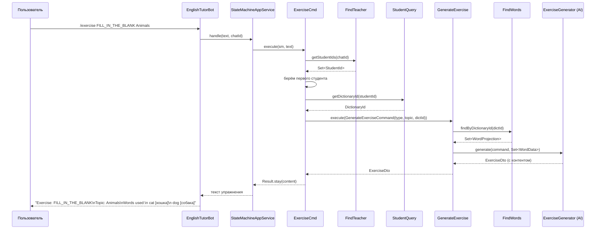

# Exercise Generation Flow

## Полный цикл: от команды до ответа

```
Пользователь → /exercise FILL_IN_THE_BLANK Animals
                  │
                  ▼
         ExerciseCmd (chatbot)
                  │
         ┌───────┼───────────┐
         │       │           │
         ▼       ▼           ▼
   FindTeacher  StudentQuery  GenerateExercise
         │       │
         │   getDictionaryId()
         │       │
         │   DictionaryId
         │       │
         └───┬───┘
             ▼
   GenerateExerciseCommand(type, topic, dictionaryId)
             │
             ▼
   GenerateExerciseUseCase
     ├── findWords.findByDictionaryId(dictId) → Set<WordProjection>
     ├── Exercise.create(id, type, topic, wordIds)
     ├── generator.generate(command, Set<WordData>)
     │     └── SpringAiExerciseGenerator (скелет, будет Spring AI)
     ├── exercise.setContent(result.content())
     └── ExerciseRepository.save(exercise)
             │
             ▼
   ExerciseDto → текст в Telegram
```

## Реализованные компоненты

### Dictionary API
| Компонент | Назначение |
|-----------|-----------|
| `FindWords` | Интерфейс: `findByDictionaryId(DictionaryId) → Set<WordProjection>` |
| `WordProjection` | Record: `id`, `value`, `translations`, `partOfSpeech` |
| `FindWordsService` | Реализация: достаёт Dictionary из репозитория, мапит Word → WordProjection |

### Exercise Module
| Компонент | Назначение |
|-----------|-----------|
| `GenerateExercise` | Интерфейс в API: `execute(GenerateExerciseCommand) → ExerciseDto` |
| `GenerateExerciseCommand` | Record: `type`, `topic`, `dictionaryId` |
| `ExerciseDto` | Record: `id`, `type`, `topic`, `content`, `status` |
| `GenerateExerciseUseCase` | Получает слова через `FindWords`, создаёт Exercise, вызывает генератор, сохраняет |
| `ExerciseGenerator` | Порт: `generate(GenerateExerciseCommand, Set<WordData>) → ExerciseDto` |
| `WordData` | Record: `value`, `translations`, `partOfSpeech` (для передачи в AI) |
| `SpringAiExerciseGenerator` | Скелет адаптера. Сейчас выводит placeholder с использованными словами |
| `ExerciseType` | Enum: `FILL_IN_THE_BLANK`, `MATCHING`, `TRANSLATION`, `MULTIPLE_CHOICE` |
| `ExerciseStatus` | Enum: `GENERATED` |

### Chatbot
| Компонент | Назначение |
|-----------|-----------|
| `ExerciseCmd` | Команда `/exercise <type> <topic>`. Доступна в ACTIVE и IN_LESSON. Берёт первого студента учителя |
| `CommandDispatcherConfig` | Добавлен `GenerateExercise` |
| `CommandDispatcherImpl` | Зарегистрирован `ExerciseCmd` |

### Зависимости
```java
// exercise/package-info.java
@ApplicationModule(allowedDependencies = "dictionary :: dictionary")

// chatbot/package-info.java — добавлено
allowedDependencies = {..., "exercise :: exercise"}
```

## Диаграмма последовательности



## Что осталось доделать

1. **Spring AI интеграция** — заменить скелет `SpringAiExerciseGenerator` на реальный вызов LLM
2. **Выбор студента** — сейчас берётся первый, нужно дать выбор (особенно в ACTIVE, где нет активного урока)
3. **В IN_LESSON** — брать слова только из активного урока, а не из всего словаря
4. **Упражнения в документе** — экспорт сгенерированного упражнения
