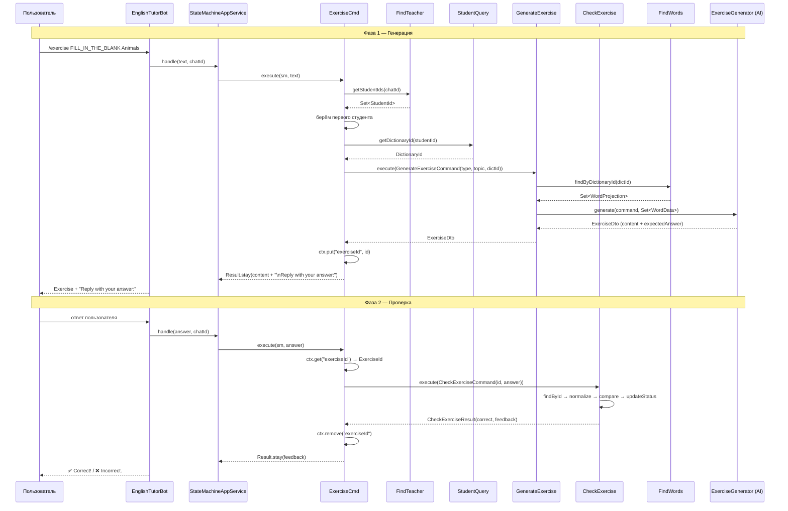

# Exercise Generation Flow

## Полный цикл: от команды до ответа

### Фаза 1: Генерация

```
Пользователь → /exercise FILL_IN_THE_BLANK Animals
                  │
                  ▼
         ExerciseCmd (chatbot)
                  │
         ┌───────┼───────────┐
         │       │           │
         ▼       ▼           ▼
   FindTeacher  StudentQuery  GenerateExercise
         │       │
         │   getDictionaryId()
         │       │
         │   DictionaryId
         │       │
         └───┬───┘
             ▼
   GenerateExerciseCommand(type, topic, dictionaryId)
             │
             ▼
   GenerateExerciseUseCase
     ├── findWords.findByDictionaryId(dictId) → Set<WordProjection>
     ├── Exercise.create(id, type, topic, wordIds)
     ├── generator.generate(command, Set<WordData>) → ExerciseDto (content + expectedAnswer)
     │     └── SpringAiExerciseGenerator (скелет, будет Spring AI)
     ├── exercise.setContent(dto.content())
     ├── exercise.setExpectedAnswer(dto.expectedAnswer())
     └── ExerciseRepository.save(exercise)
             │
             ▼
   ExerciseCmd: сохраняет exerciseId в context, возвращает "Reply with your answer:"
```

### Фаза 2: Проверка ответа

```
Пользователь → текст ответа
                  │
                  ▼
         ExerciseCmd (видит exerciseId в context)
                  │
                  ▼
         CheckExerciseCommand(exerciseId, userAnswer)
                  │
                  ▼
         CheckExerciseUseCase
     ├── repository.findById(exerciseId)
     ├── exercise.markAnswered()
     ├── нормализация + сравнение с expectedAnswer
     ├── если правильно → exercise.markChecked()
     ├── repository.save(exercise)
     └── CheckExerciseResult(correct, feedback, exerciseDto)
             │
             ▼
   ✅/❌ + результат
```

## Реализованные компоненты

### Dictionary API
| Компонент | Назначение |
|-----------|-----------|
| `FindWords` | Интерфейс: `findByDictionaryId(DictionaryId) → Set<WordProjection>`, `getStats(DictionaryId) → DictionaryStats` |
| `WordProjection` | Record: `id`, `value`, `translations`, `partOfSpeech` |
| `DictionaryStats` | Record: `totalWords`, `newCount`, `inProgressCount`, `learnedCount` |
| `FindWordsService` | Реализация: достаёт Dictionary из репозитория, мапит Word → WordProjection, считает статистику |

### Exercise Module
| Компонент | Назначение |
|-----------|-----------|
| `GenerateExercise` | Интерфейс в API: `execute(GenerateExerciseCommand) → ExerciseDto` |
| `CheckExercise` | Интерфейс в API: `execute(CheckExerciseCommand) → CheckExerciseResult` |
| `GenerateExerciseCommand` | Record: `type`, `topic`, `dictionaryId` |
| `CheckExerciseCommand` | Record: `exerciseId`, `userAnswer` |
| `CheckExerciseResult` | Record: `correct`, `feedback`, `exercise` |
| `ExerciseDto` | Record: `id`, `type`, `topic`, `content`, `expectedAnswer`, `status` |
| `ExerciseType` | Enum в `api/exercise/`: `FILL_IN_THE_BLANK`, `MATCHING`, `TRANSLATION`, `MULTIPLE_CHOICE` |
| `ExerciseStatus` | Enum: `GENERATED`, `ANSWERED`, `CHECKED` |
| `GenerateExerciseUseCase` | Получает слова через `FindWords`, создаёт Exercise, вызывает генератор, сохраняет |
| `CheckExerciseUseCase` | Находит Exercise, проверяет ответ, обновляет статус |
| `ExerciseGenerator` | Порт: `generate(GenerateExerciseCommand, Set<WordData>) → ExerciseDto` |
| `WordData` | Record: `value`, `translations`, `partOfSpeech` (для передачи в AI) |
| `SpringAiExerciseGenerator` | Скелет адаптера. Сейчас выводит placeholder с использованными словами |

### Chatbot
| Компонент | Назначение |
|-----------|-----------|
| `ExerciseCmd` | Двухфазная команда: генерация → проверка ответа. Хранит `exerciseId` в context |
| `CommandDispatcherConfig` | Добавлены `GenerateExercise` и `CheckExercise` |
| `CommandDispatcherImpl` | Зарегистрирован `ExerciseCmd` |

### Зависимости
```java
// exercise/package-info.java
@ApplicationModule(allowedDependencies = {"dictionary :: dictionary", "dictionary :: word"})

// chatbot/package-info.java
allowedDependencies = {..., "exercise :: exercise"}
```

## Диаграмма последовательности (полный цикл)



## Что осталось доделать

1. **Spring AI интеграция** — заменить скелет `SpringAiExerciseGenerator` на реальный вызов LLM
2. **Фильтр слов по статусу** — в roadmap упражнения генерируются только для слов в статусе `IN_PROGRESS`
3. **Ограничить типы упражнений** — roadmap просит 2 типа: FILL_IN_THE_BLANK + MULTIPLE_CHOICE (сейчас 4)
4. **Выбор студента** — сейчас берётся первый, нужно дать выбор (особенно в ACTIVE, где нет активного урока)
5. **В IN_LESSON** — брать слова только из активного урока, а не из всего словаря
