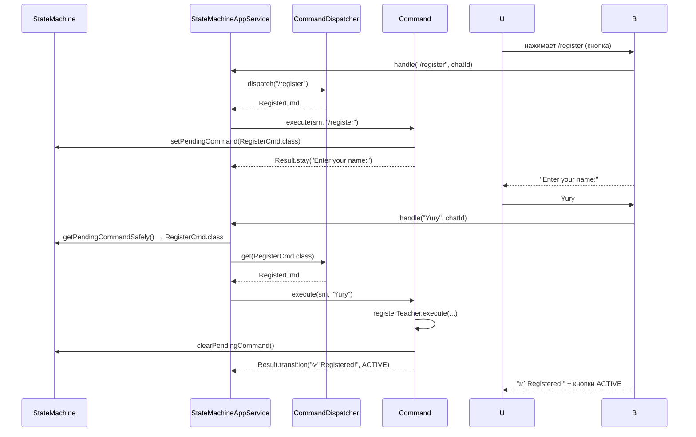
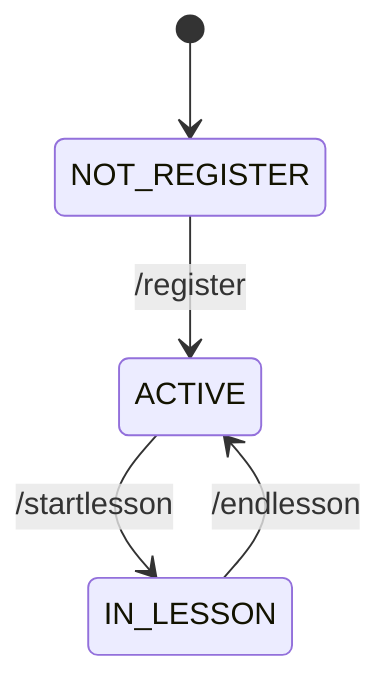
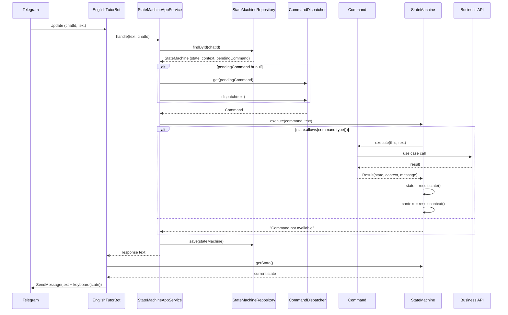
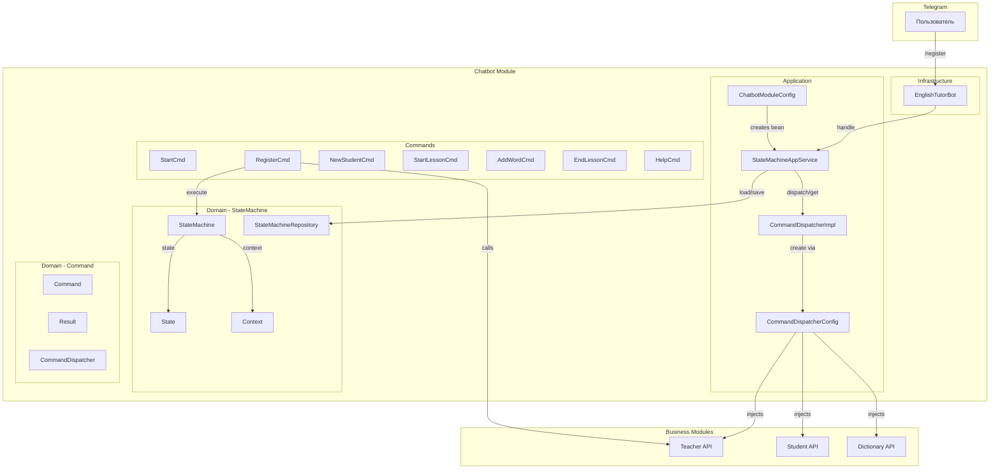
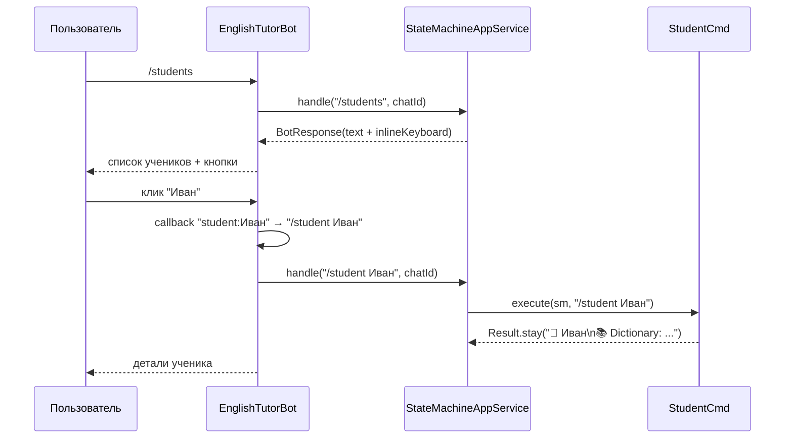

# Telegram Bot State Machine

## Состояния

```
NOT_REGISTER → ACTIVE → IN_LESSON → ACTIVE → ...
```

| State | Контекст | Допустимые команды |
|-------|----------|-------------------|
| `NOT_REGISTER` | — | `/start`, `/register`, `/help` |
| `ACTIVE` | — | `/start`, `/newstudent`, `/startlesson`, `/students`, `/student`, `/exercise`, `/help` |
| `IN_LESSON` | `context["lessonId"] = UUID` | `/add`, `/endlesson`, `/students`, `/student`, `/exercise`, `/help` |

## Двухфазный ввод (через pendingCommand)

Команды с аргументами (`/register`, `/newstudent`, `/startlesson`, `/add`) работают в два шага:



1. **Кнопка** — команда сохраняет `pendingCommand` (класс) и просит ввод
2. **Текст** — `StateMachineAppService` видит pending, получает команду по классу, выполняет с текстом

## Граф переходов



## Полный цикл обработки сообщения



## Многошаговый ввод AddWordCmd

`/add` использует context как временное хранилище для трёхшагового ввода:

```
/add → "Enter word:"       (step=0, pending=AddWordCmd)
  apple → "Enter POS:"      (step=1, word=apple)
  NOUN → "Enter translation:" (step=2, pos=NOUN)
  яблоко → "✅ added"      (done, clearPending)
```

Альтернативно: `/add apple NOUN яблоко` — все три шага в одном сообщении.

## Архитектура взаимодействия



---

## Callback-запросы (inline-кнопки)

С версии, добавившей фичи 3 и 4, бот поддерживает inline-кнопки и callback-запросы:



Callback конвертируется в текстовую команду и проходит через общий `service.handle()` — бот остаётся тонким адаптером.

## Inline-клавиатура в Result

```java
// Result record с опциональной inline-клавиатурой
public record Result(String message, CommandType commandType, State state,
                     Optional<Context> context, List<List<String>> inlineKeyboard) {

    public static Result stay(String message, CommandType type) { ... }

    // Новый метод: stay с inline-кнопками
    public static Result stay(String message, CommandType type,
                              List<List<String>> inlineKeyboard) { ... }
}
```

`BotExecuteResult` передаёт inlineKeyboard из StateMachine в StateMachineAppService,
который возвращает `BotResponse` с текстом и кнопками.

## Context — новые методы

```java
public class Context {
    public void put(String key, Object value) { ... }
    public Object get(String key) { ... }
    public void remove(String key) { ... }          // NEW
    public <T> T get(String key, Class<T> type) { ... }
}
```

## ExerciseCmd — двухфазная работа

```
/exercise FILL_IN_THE_BLANK Animals  →  генерация + "Reply with your answer:"
  user types answer                   →  CheckExercise → ✅/❌ + результат
```

В context сохраняется `exerciseId` для проверки ответа. После проверки — очистка.

## Новые команды (v1.0.0)

| Команда | Класс | Назначение |
|---------|-------|-----------|
| `/students` | `StudentsCmd` | Список учеников с inline-кнопками |
| `/student <name>` | `StudentCmd` | Детали ученика: словарь, статус урока |
| `/exercise` | `ExerciseCmd` | Генерация и проверка упражнений |
